# Atlas Recall

**A geography-learning app I conceived to make learning all 195 countries more complete, visual, and structured — combining active recall, progress tracking, adaptive review, and an interactive globe.**

> **Project showcase** · Source code maintained privately · Personally tested on iPhone and web

| Home | Interactive globe |
|:---:|:---:|
| 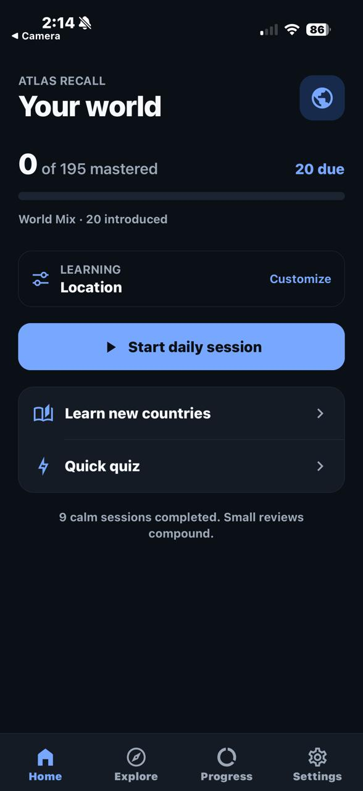 | 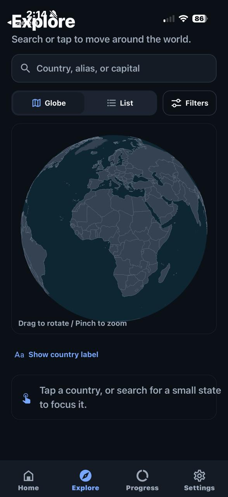 |
| Quiz feedback | Progress |
| 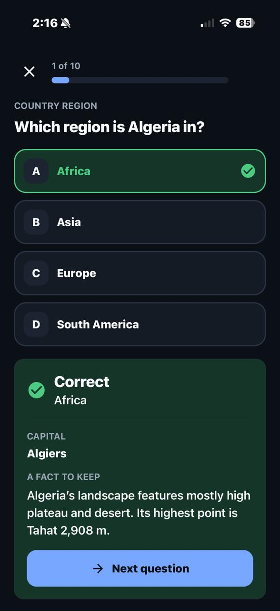 | 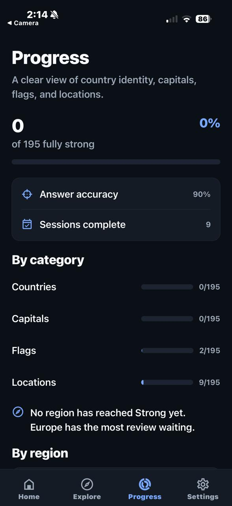 |

## Why I created Atlas Recall

I wanted to expand my general knowledge by learning every country's name, capital, flag, and location. I tried several existing apps, but parts of the experience I wanted were either paid or simply missing. Rather than settle for that combination of limitations, I defined the learning product I wanted to use myself and turned it into Atlas Recall.

The goal was not just to make another flag quiz. I wanted one coherent experience for **discovering countries, practising different kinds of recall, revisiting mistakes, and seeing exactly where my knowledge was weak**.

## What exists today

- **195 countries**, with country identity, capital, flag, and location tracked as four separate learning dimensions.
- **Structured learning and review**, including daily sessions, quick quizzes, weak-item practice, mistake review, and delayed retries.
- **Multiple question formats**, including region, capital, flag, map recognition, and finding a country directly on the globe.
- **Explore mode** with both a searchable country list and an interactive globe, plus country information and sourced facts.
- **Adaptive practice and progress tracking** by category and region.
- **Personalisation and accessibility options**, including daily question count, regional focus, quiz style, haptics, reduced motion, and light/dark themes.
- **Local progress with no account required** for the core experience.

## Product walkthrough

### Explore the world and choose what to practise

Explore is not limited to a quiz screen: all 195 countries can be searched and browsed, while review sessions can mix country identity, capitals, flags, and locations depending on what the learner wants to reinforce.

| Searchable country list | Review selection |
|:---:|:---:|
| 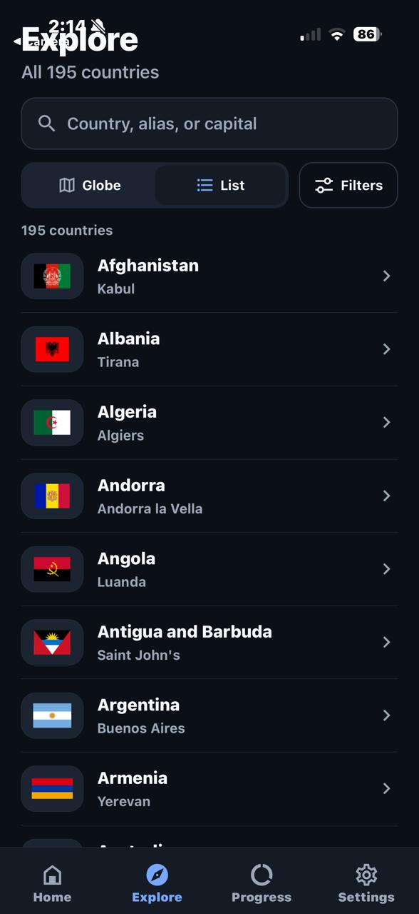 | 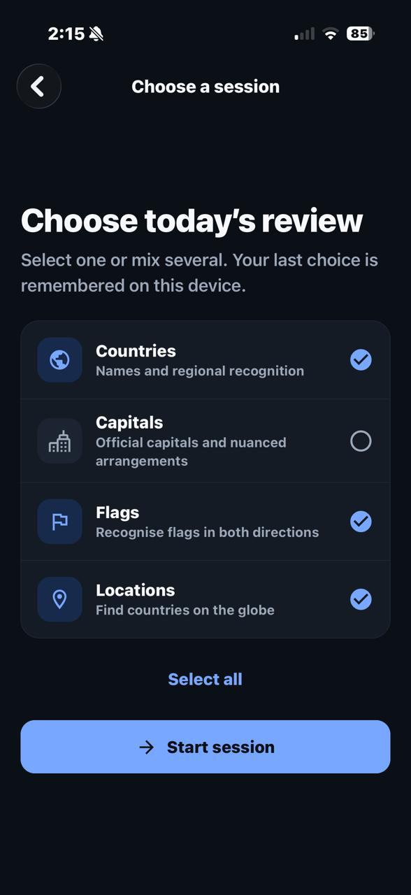 |

### Practise different kinds of recall

I wanted location knowledge to mean more than recognising a country name. Atlas Recall therefore combines conventional questions with visual and spatial recall, including flags and map-based identification.

| Flag recognition | Map recognition |
|:---:|:---:|
| 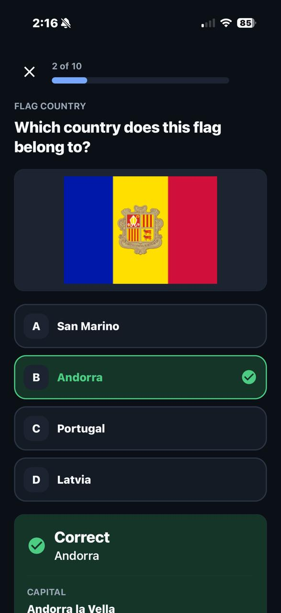 | 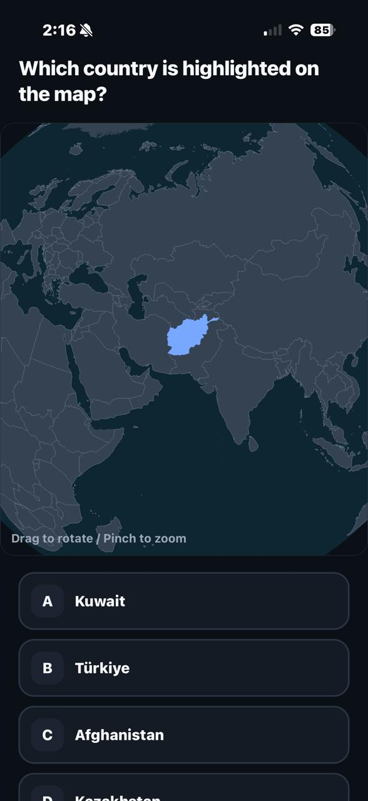 |

### Turn mistakes into another learning step

Wrong answers are not treated as a dead end. Feedback identifies the correct country and surfaces useful context, while location questions can ask the learner to find the country directly on the globe.

| Answer feedback and country context | Finding a country on the globe |
|:---:|:---:|
| 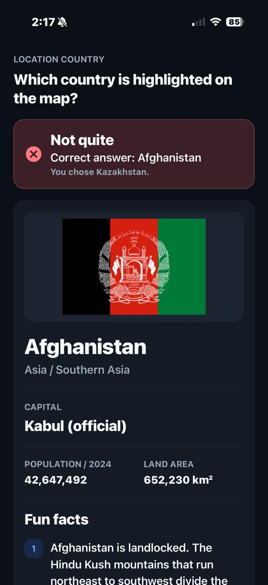 | 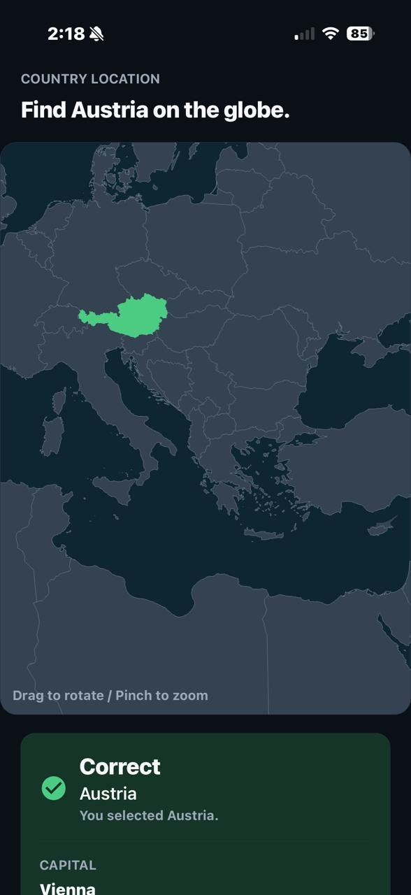 |

### Personalise the experience and close the feedback loop

The learning experience can be adjusted to the user's pace and preferences. At the end of a session, results are broken down by category and mistakes can be revisited immediately rather than disappearing into a generic score.

| Learning and accessibility settings | Session results |
|:---:|:---:|
| 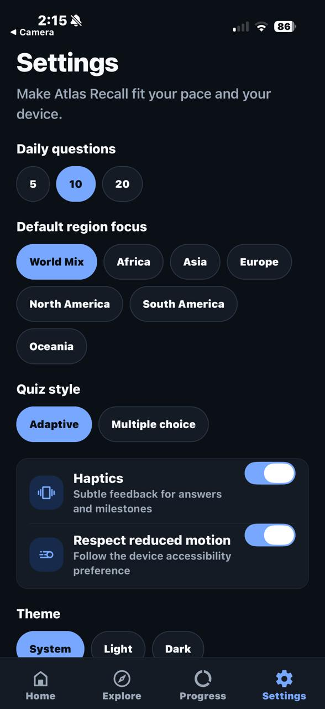 | 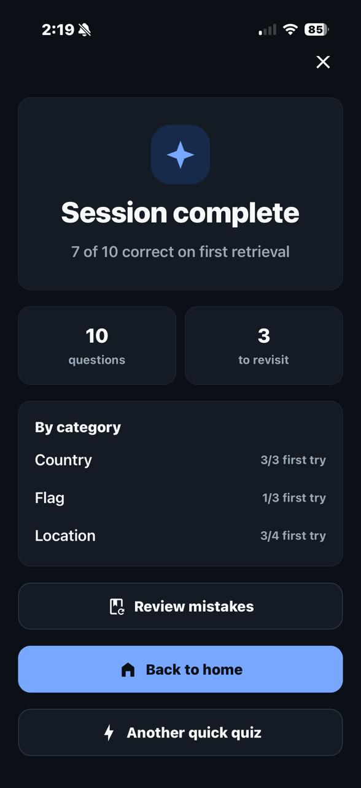 |

## My role and AI-assisted development

Atlas Recall is an **AI-assisted personal product project**. I conceived the product, defined its features and learning flows, decided how I wanted the experience to behave, directed successive iterations, and tested the resulting builds on a physical iPhone and on the web.

I used **OpenAI Codex as the coding agent** to translate those specifications into a working application. Codex generated the source code and handled the underlying technical implementation; I did not manually author that code. My contribution was therefore concentrated on **problem definition, product and UX decisions, requirements, AI-directed iteration, hands-on testing, and deciding what to change or keep**.

That distinction is intentional: this showcase presents the product and my development process without implying manual programming authorship that did not occur.

## Technical snapshot

The current Codex-generated implementation uses:

- **React Native, Expo, and TypeScript** for the cross-platform application.
- **WebGL / `expo-gl`** for an interactive globe built from real country geometry.
- **Device-local, versioned persistence** for settings and learning progress.
- **Adaptive review logic** for due, weak, new, and maintenance material.
- **Automated testing with Jest** — the current project record contains 9 test suites / 70 passing tests.

The current project verification record also reports successful data validation, TypeScript/lint checks, Expo Doctor checks, and production exports for **iOS, Android, and web**. I have personally run and used the app on **iPhone and web**.

## Current status and known limitation

The main feature set I originally wanted is implemented and the app is usable. The principal known limitation is the interactive globe on iPhone: touch interaction can occasionally become laggy or visually glitchy. Improving that interaction and rendering performance would be the first area I would revisit.

## About this repository

This repository is a public **project showcase**, not the source repository. It contains visual evidence and a high-level technical overview of Atlas Recall; the application source code is intentionally maintained privately.
